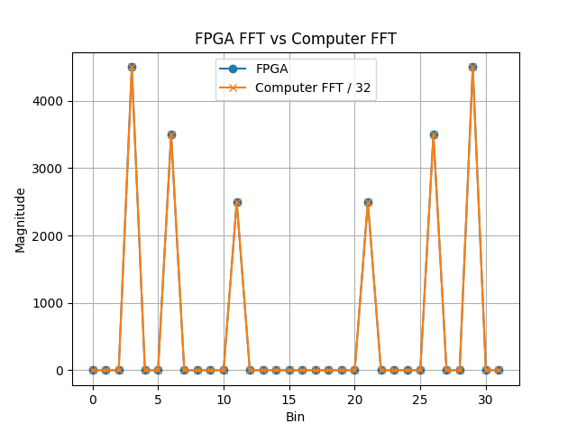

# 32-Point SDF FFT Pipeline on Zynq FPGA

This project implements a custom 32 point fixed-point radix-2 SDF FFT pipeline on a Zynq FPGA. The system transfers input samples from the Zynq Processing System (PS) to custom logic in the Programmable Logic (PL), computes the FFT, and returns the results back to the PS for comparison against a software reference.

The project was built as a prototype for a larger FPGA based FMCW radar signal processing pipeline. The main goal was to develop and validate the complete hardware/software path around a custom FFT core, not only the FFT algorithm itself.

## Overview

The design combines bare metal C running on the Zynq PS with custom Verilog modules in the PL. Input samples are written from the PS through an AXI4-Lite slave interface into a PL side buffer. The buffer feeds a streaming SDF FFT pipeline and stores the resulting FFT outputs for the PS to read back.

The system was verified on hardware using generated test signals and compared against software FFT results in Python/NumPy.

## Main Features

* 32 point radix-2 SDF FFT written in Verilog
* Fixed point complex arithmetic
* BRAM based delay lines
* Twiddle ROMs for stage specific coefficients
* Custom AXI4-Lite slave interface
* PL side input/output buffer for PS to FFT communication
* Bare metal C application running on the Zynq PS
* Python based host program for sending samples and plotting results
* Hardware tested against software FFT references

## Hardware and Tools

* Zynq-7000 FPGA platform
* Vivado for PL design, synthesis, implementation, and debug
* Vitis for bare metal PS software
* Verilog for the FFT core and buffer logic
* C for PS-side AXI and UART control
* Python, NumPy, and Matplotlib for host-side testing and visualization

## FFT Architecture

The FFT core uses a radix-2 single-path delay feedback architecture. Each stage performs butterfly operations and twiddle multiplication where needed. The design uses fixed point arithmetic and produces output in bit reversed order, which is reordered in software when comparing against NumPy.

## PS/PL Interface

The PS communicates with the PL through a small AXI4-Lite register interface. The interface exposes status signals, an input data register, and an output data register.

The PL buffer handles the transfer between the AXI interface and the streaming FFT core. It loads a full 32-sample frame, feeds it into the FFT, stores the outputs, and then allows the PS to read the results back.