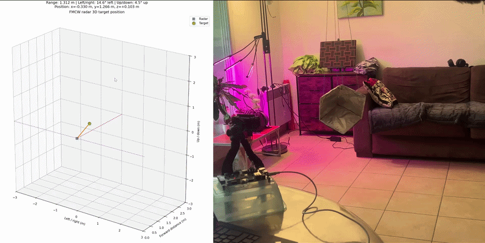
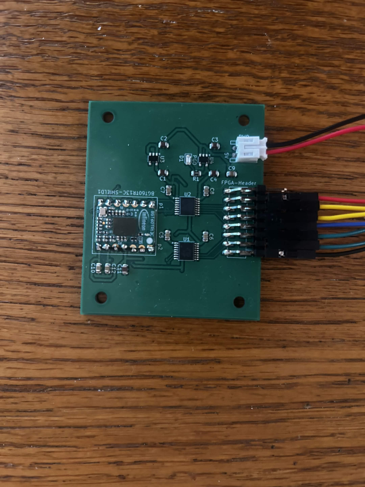

# FPGA FMCW Radar Pipeline

This project implements a complete real-time radar system using an Infineon BGT60TR13C shield radar sensor and a Xilinx Zynq-7000 SoC. The radar detects the strongest object in front of it, calculates its distance and direction on the FPGA, and sends the resulting 3D position to a Python application for visualization. The demonstration below shows the system tracking a moving corner reflector.

## Overview

The complete processing chain is:

BGT60TR13C
    -> Radar configuration
    -> SPI acquisition
    -> three-channel buffering
    -> Hann windowing
    -> three 256-point range FFTs, built from scratch
    -> strongest-target detection
    -> range and angle calculation
    -> AXI4-Lite
    -> Zynq processing system
    -> UART
    -> Python 3D visualization

Nearly all radar processing is performed in programmable logic. The processing system only reads the completed result and forwards it to the computer over UART.

## Hardware

The system consists of:

* Infineon BGT60TR13C 60 GHz FMCW radar shield
* Zybo Z7 with a Xilinx Zynq-7000 SoC
* Custom radar-to-PMOD adapter PCB
* Three radar receiver channels and one transmitter
* USB UART connection to the computer

The radar operates with 1.8 V logic, while the Zybo PMOD uses 3.3 V logic. The custom PCB uses two SN74AVC4T245 level translators and an AP2112K 1.8 V regulator to safely connect the boards. The adapter PCB is shown below:

## Radar Configuration

The FPGA configures the BGT60TR13C through SPI using register values stored in a ROM. It starts each frame, waits for the sensor FIFO interrupt, and performs a burst read of the ADC samples.

The current configuration uses:

* Three receiver channels
* 256 samples per receiver
* 768 ADC samples per frame
* 256-point range FFTs
* FFT bins 6 through 127 for target detection
* 37.5 mm of range per FFT bin
* A 100 MHz FPGA clock
* A frame period of approximately 20 ms
* An update rate of approximately 50 FPS

## Signal Processing

### Acquisition and Buffering

The BGT60TR13C produces interleaved 12-bit unsigned ADC samples from its three receiver channels. The FPGA reads the FIFO over SPI, separates the channels, subtracts the ADC midpoint of 2048, and stores each channel in BRAM.

### Hann Window

A 256-point Hann window is applied before each FFT to reduce spectral leakage. The coefficients are stored in ROM as unsigned Q0.12 values.

### Range FFT

A separate 256-point fixed-point FFT is calculated for each receiver. Only positive-frequency bins 6 through 127 are searched. The lowest bins are ignored because they primarily contain DC leakage and direct coupling. The FFT module was made from scratch in the previous project, found under the "simulated-FMCW-pipeline" repository.

### Peak Detection

For each candidate bin, the design calculates:

power = real^2 + imaginary^2

The power values from all three receivers are added together. The bin with the largest combined response is selected as the strongest target.

### Range Calculation

Range is calculated directly from the selected FFT bin:

range_um = peak_bin * 37,500

The FPGA outputs range as an unsigned 24-bit integer in micrometres.

### Angle Calculation

Azimuth and elevation are calculated from the phase differences between the complex FFT outputs of different receiver pairs.

The design:

1. Multiplies one receiver value by the complex conjugate of another
2. Uses a custom CORDIC atan2 module to calculate the phase difference
3. Applies experimentally measured boresight phase offsets
4. Uses an inverse-sine lookup table to calculate the final angle

Phase and angle values use signed radians scaled by 2^15.

The inverse-sine ROM discards seven least-significant phase bits before lookup:

lut_address = abs(corrected_phase) >> 7

This reduces the ROM to 805 entries while retaining angular resolution.

The final RTL outputs are:

output reg signed [17:0] alpha;
output reg signed [17:0] beta;
output reg        [23:0] range_calc;

* alpha is the azimuth in radians multiplied by 2^15
* beta is the elevation in radians multiplied by 2^15
* range_calc is the range in micrometres

## Data Transfer and Visualization

The completed results are exposed to the Zynq processing system through a custom AXI4-Lite peripheral using the Vivado AXI4-Lite template.

Embedded C software waits for a valid result, reads the three output registers, and sends them over UART at 921,600 baud.

Each packet contains:

uint32 range_um
int32  alpha_q15
int32  beta_q15

The Python application decodes the packet, converts the fixed-point values to metres and degrees, transforms the spherical coordinates into Cartesian coordinates, and updates a Matplotlib 3D display.

The current implementation displays one point because the FPGA returns only the strongest target.

## Fixed-Point Formats

The main fixed-point formats are:

* Raw ADC sample: 12-bit unsigned integer
* Centered ADC sample: signed integer
* Hann coefficient: unsigned Q0.12
* FFT input: 24-bit signed with 15 fractional bits
* FFT real and imaginary outputs: 24-bit signed
* Phase: signed radians multiplied by 2^15
* Azimuth and elevation: signed radians multiplied by 2^15
* Range: unsigned integer, micrometres

Intermediate calculations use wider values to prevent overflow before truncation.

## Main RTL Modules

* bgt_master: radar configuration and acquisition state machine
* spi_master: radar register transactions
* burst_spi_master: continuous FIFO burst reads
* config_rom: BGT60TR13C register configuration
* io_buffer: buffering and signal-processing control
* hann_rom: Hann-window coefficients
* sdf_fft: three 256-point range FFTs
* atan2_cordic: phase-difference calculation
* cordic_angle_rom: CORDIC constants
* asin_rom: phase-to-angle conversion
* AXI4-Lite slave: transfers completed results to the processing system

## FPGA Implementation

The design meets timing at 100 MHz with a worst negative slack of **+0.428 ns**.

Resource utilization:

* LUT: 5,689 used, 32%
* Flip-flops: 5,418 used, 15%
* BRAM: 14.5 blocks used, 24%
* DSP slices: 50 used, 63%

DSP slices are the most heavily used resource because of the FFTs, window multiplication, magnitude calculations, and complex phase arithmetic.

## Verification

The pipeline was verified using:

* RTL simulation
* Python and NumPy reference calculations
* Synthetic ADC signals with known frequencies and phase offsets
* Vivado ILA and VIO
* Comparison of FPGA FFT outputs with software FFTs
* Fixed-point range and angle comparisons
* Physical testing with a corner reflector
* Measurements at boresight and different target distances

The Python reference model reproduces the same fixed-point scaling and seven-bit phase truncation used by the RTL.

