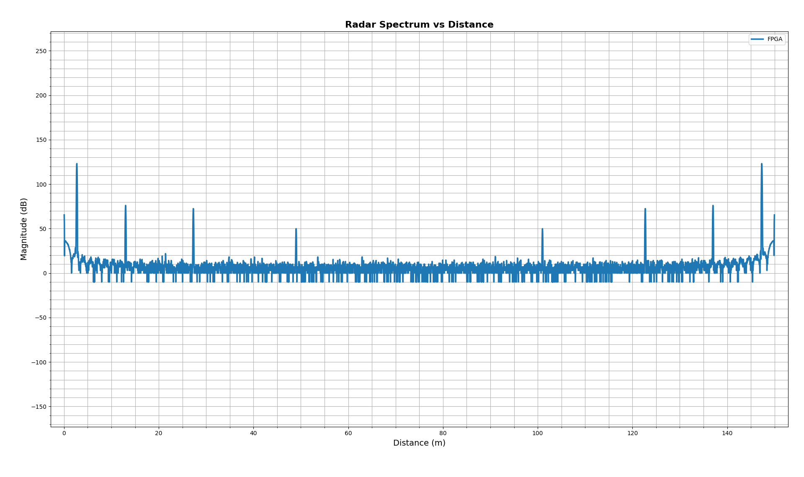
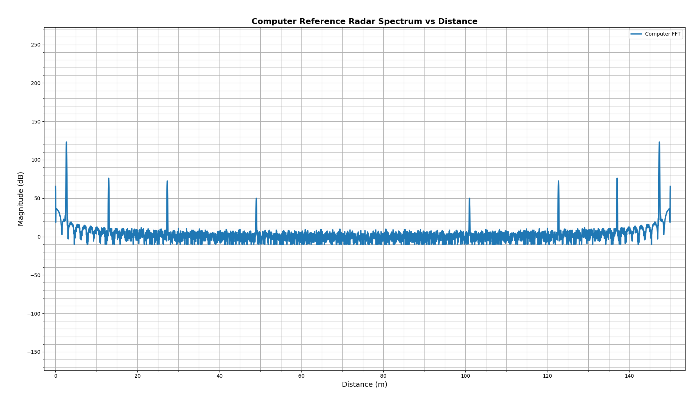
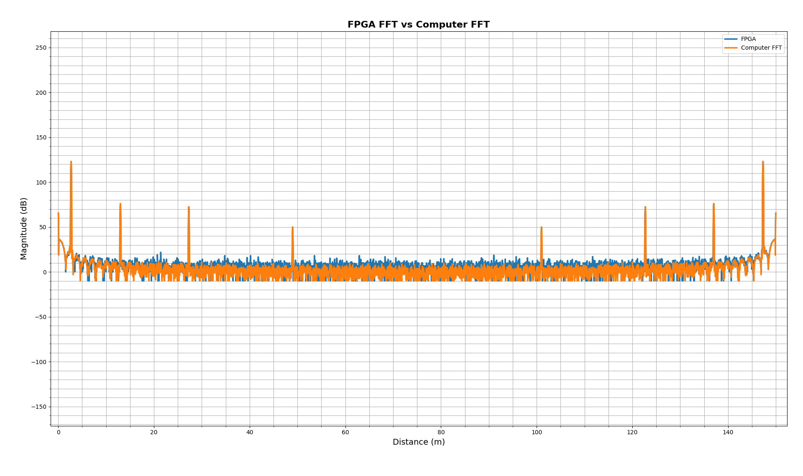

# Simulated FMCW Radar Signal Processing Pipeline on Zynq FPGA

This project implements a custom FPGA based signal processing pipeline for simulated FMCW radar data. The main component is a hand written 4096-point radix-2 SDF FFT accelerator written in Verilog and integrated with the Zynq Processing System through an AXI4-Lite interface. The project uses a simple model of a FMCW radar generated by my supervisor, Johan Holmstedt, in a room with three objects (corresponding to the three peaks shown in the graphs below). Note that the FFT is symmetrical, meaning these three peaks get mirrored on the right of the FFT:

FFT generated by the FPGA: 

Reference FFT generated by NumPy:

FPGA FFT vs NumPy FFt. The peaks line up exactly, while small differences in the noise get blown up due to the logarithmic scale:

The project began as a 32 point FFT pipeline, was expanded to 128 points to verify that the stage modules were properly parameterized, and was then scaled to 4096 points for simulated FMCW radar range processing.

This repository contains the cleaned up public version of a project developed locally as part of my undergraduate research work at Lund University EIT.

---

## Overview

The full system sends simulated radar samples from a computer to the FPGA, computes a 4096 point FFT in programmable logic, returns the result, and compares it against a software FFT reference. The FFT module is scaled by 1/16 to prevent overflow.

The full pipeline is structured as the following:

CSV / Python radar samples
->        
UART
->         
Zynq Processing System
->         
AXI4-Lite
->         
BRAM backed input/output buffer
->         
4096-point SDF FFT pipeline
->         
BRAM backed input/output buffer
->         
AXI4-Lite
->         
Zynq Processing System
->         
UART
->         
Python / NumPy verification and plotting

## Hardware Usage
 * 6000 LUT                 35%
 * 6300 FF                  8%
 * 482 LUTRAM               18%
 * 100 kB BRAM (26 units)   43%
 * 44 DSP                   55%

## Features

 * Custom radix-2 SDF FFT written from scratch in Verilog
 * 4096 point FFT pipeline
 * Parameterized FFT stage modules
 * 24 bit signed fixed-point internal data path
 * 16 bit signed twiddle factors
 * BRAM based delay lines and input/output buffering
 * AXI4-Lite interface between PS and PL
 * UART based communication between PC and Zynq PS
 * Python verification against NumPy FFT
 * Simulated FMCW radar range spectrum plotting
 * Bit reversed output correction in Python
 * dB-scale radar spectrum visualization

## Hardware and Tools

 * FPGA platform:   Zynq-7000 SoC
 * Board used: 	    Zybo Z7 Development Board
 * HDL:             Verilog
 * FPGA tools:      Vivado
 * PS software:     Vitis/C
 * Host software:   Python/NumPy/Matplotlib
 * Communication:   UART
 * PS/PL interface: AXI4-Lite

## Architecture

PL: The FFT is implemented as a radix-2 single-path delay feedback pipeline. The FFT output is produced in bit-reversed order. The Python verification script reorders the bins into natural order before comparing the FPGA output against the NumPy reference. The single-path delay feedback architecture is particularly attractive for FMCW radar signal processing because it provides a throughput of 1.

The AXI4-Lite slave exposes the following registers:

 * 0x00 COUNTER   Debug counter
 * 0x04 STATUS    bit 0 = input ready, bit 1 = output valid
 * 0x08 IN_IMAG   Input imaginary component, lower 24 bits
 * 0x0C IN_REAL   Input real component, lower 24 bits
 * 0x10 OUT_IMAG  Output imaginary component, lower 24 bits
 * 0x14 OUT_REAL  Output real component, lower 24 bits

PS: The PS receives the data through UART from the Python program and packs each byte into a sample. It feeds 4096 samples to the AXI slave. When the FFT presents an output through the AXI slave, it receives it and breaks it up into bytes to send back over UART.

## Python

The python program sends samples precomputed from a CSV file over UART to the PS. It receives the output of the FFT in bit reversed order from the PS over UART and plots it in natural order. The program also plots a FFT computed locally through NumPy and compares it to the FPGA output. Note that there are slight differences in the NumPy FFT and FPGA FFT due to differences in fixed point representation of the data on FPGA and Python. These small differences blow up on a logarithmic scale, though the three peaks representing three objects in the room line up exactly on both graphs. 
